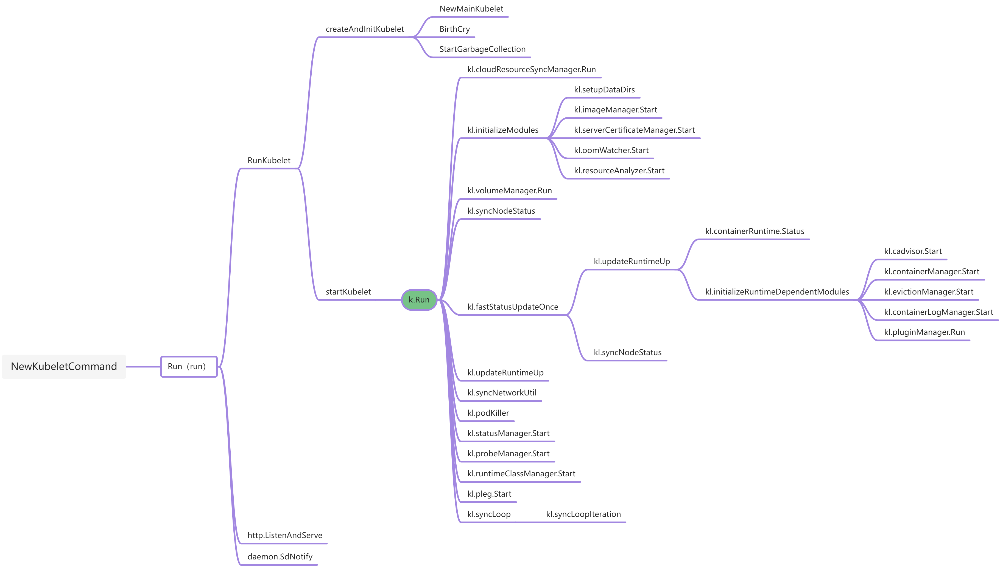

​<br />
<a name="BEhLZ"></a>
## Kubelet 启动流程
kubernetes 版本：v1.23<br />本文重点分析启动流程和涉及的模块。会省去无关注释和代码，关注者可以从代码链接自行查阅。
<a name="J0Cfm"></a>
## Overview
<a name="yboE7"></a>

## main
```go
func main() {
	command := app.NewKubeletCommand()

	// kubelet uses a config file and does its own special
	// parsing of flags and that config file. It initializes
	// logging after it is done with that. Therefore it does
	// not use cli.Run like other, simpler commands.
	code := run(command)
	os.Exit(code)
}
```
<a name="gCbx3"></a>
## NewKubeletCommand
首先从 kubelet 的 main 函数开始，其中调用的 NewKubeletCommand 方法主要负责获取配置文件中的参数，校验参数以及为参数设置默认值。主要逻辑为：

1. kubelet 配置解析
1. 解析命令行参数；
1. 为 kubelet 初始化 [feature gates](https://kubernetes.io/docs/reference/command-line-tools-reference/feature-gates/) 参数；
1. 加载 kubelet 配置文件；
1. 校验配置文件中的参数；
1. 检查 kubelet 是否启用[动态配置](https://kubernetes.io/zh/blog/2018/07/11/%E5%8A%A8%E6%80%81-kubelet-%E9%85%8D%E7%BD%AE/)功能；
1. 运行前检查 Kubelet 是不是 uid = 0 的权限运行;
1. 初始化 log;
1. 初始化 kubeletDeps，kubeletDeps 包含 kubelet 运行所必须的配置，是为了实现 dependency injection，其目的是为了把 kubelet 依赖的组件对象作为参数传进来，这样可以控制 kubelet 的行为；
1. 调用 Run 方法；

[k8s.io/kubernetes/cmd/kubelet/app/server.go:111](https://sourcegraph.com/github.com/kubernetes/kubernetes@2ac6a4121f5b2a94acc88d62c07d8ed1cd34ed63/-/blob/cmd/kubelet/app/server.go?L115)
```go
func NewKubeletCommand() *cobra.Command {
    cleanFlagSet := pflag.NewFlagSet(componentKubelet, pflag.ContinueOnError)
    cleanFlagSet.SetNormalizeFunc(cliflag.WordSepNormalizeFunc)
    
    // 1、kubelet配置分两部分:
    // KubeletFlag: 指那些不允许在 kubelet 运行时进行修改的配置集，或者不能在集群中各个 Nodes 之间共享的配置集。
    // KubeletConfiguration: 指可以在集群中各个Nodes之间共享的配置集，可以进行动态配置。
    kubeletFlags := options.NewKubeletFlags()
    kubeletConfig, err := options.NewKubeletConfiguration()
	if err != nil {
		klog.ErrorS(err, "Failed to create a new kubelet configuration")
		os.Exit(1)
	}
    
    cmd := &cobra.Command{
        Use: componentKubelet,
        DisableFlagParsing: true,
        ......
        Run: func(cmd *cobra.Command, args []string) {
            // 2、解析命令行参数
            if err := cleanFlagSet.Parse(args); err != nil {
      			klog.ErrorS(err, "Failed to parse kubelet flag")
				cmd.Usage()
				os.Exit(1)
            }
            ......
					
			// short-circuit on verflag
			verflag.PrintAndExitIfRequested()
           
            // 3、初始化 feature gates 配置
			if err := utilfeature.DefaultMutableFeatureGate.SetFromMap(kubeletConfig.FeatureGates); err != nil {
				klog.ErrorS(err, "Failed to set feature gates from initial flags-based config")
				os.Exit(1)
			}

			if err := options.ValidateKubeletFlags(kubeletFlags); err != nil {
				klog.ErrorS(err, "Failed to validate kubelet flags")
				os.Exit(1)
			}

			if kubeletFlags.ContainerRuntime == "remote" && cleanFlagSet.Changed("pod-infra-container-image") {
				klog.InfoS("Warning: For remote container runtime, --pod-infra-container-image is ignored in kubelet, which should be set in that remote runtime instead")
			}

            // 4、加载 kubelet 配置文件
			if configFile := kubeletFlags.KubeletConfigFile; len(configFile) > 0 {
				kubeletConfig, err = loadConfigFile(configFile)
                ......
            }
            // 5、校验配置文件中的参数
			if err := kubeletconfigvalidation.ValidateKubeletConfiguration(kubeletConfig); err != nil {
				klog.ErrorS(err, "Failed to validate kubelet configuration", "path", kubeletConfig)
				os.Exit(1)
			}

            // 6、检查 kubelet 是否启用动态配置功能
			var kubeletConfigController *dynamickubeletconfig.Controller
			if dynamicConfigDir := kubeletFlags.DynamicConfigDir.Value(); len(dynamicConfigDir) > 0 {
				var dynamicKubeletConfig *kubeletconfiginternal.KubeletConfiguration
				dynamicKubeletConfig, kubeletConfigController, err = BootstrapKubeletConfigController(dynamicConfigDir,
					func(kc *kubeletconfiginternal.KubeletConfiguration) error {
						// Here, we enforce flag precedence inside the controller, prior to the controller's validation sequence,
						// so that we get a complete validation at the same point where we can decide to reject dynamic config.
						// This fixes the flag-precedence component of issue #63305.
						// See issue #56171 for general details on flag precedence.
						return kubeletConfigFlagPrecedence(kc, args)
					})
				if err != nil {
					klog.ErrorS(err, "Failed to bootstrap a configuration controller", "dynamicConfigDir", dynamicConfigDir)
					os.Exit(1)
				}
				// If we should just use our existing, local config, the controller will return a nil config
				if dynamicKubeletConfig != nil {
					kubeletConfig = dynamicKubeletConfig
					// Note: flag precedence was already enforced in the controller, prior to validation,
					// by our above transform function. Now we simply update feature gates from the new config.
					if err := utilfeature.DefaultMutableFeatureGate.SetFromMap(kubeletConfig.FeatureGates); err != nil {
						klog.ErrorS(err, "Failed to set feature gates from initial flags-based config")
						os.Exit(1)
					}
				}
			}
            
            // 7. 初始化 log
			logs.InitLogs()
			logOption := &logs.Options{Config: kubeletConfig.Logging}
			if err := logOption.ValidateAndApply(); err != nil {
				klog.ErrorS(err, "Failed to initialize logging")
				os.Exit(1)
			}
			cliflag.PrintFlags(cleanFlagSet)

            kubeletServer := &options.KubeletServer{
                KubeletFlags:         *kubeletFlags,
                KubeletConfiguration: *kubeletConfig,
            }
            // 8、初始化 kubeletDeps
			kubeletDeps, err := UnsecuredDependencies(kubeletServer, utilfeature.DefaultFeatureGate)
			if err != nil {
				klog.ErrorS(err, "Failed to construct kubelet dependencies")
				os.Exit(1)
			}

			// add the kubelet config controller to kubeletDeps
			kubeletDeps.KubeletConfigController = kubeletConfigController
            // 9.运行前检查 Kubelet 是不是 uid = 0 的权限运行
			if err := checkPermissions(); err != nil {
				klog.ErrorS(err, "kubelet running with insufficient permissions")
			}
			// set up signal context here in order to be reused by kubelet and docker shim
			ctx := genericapiserver.SetupSignalContext()

			// make the kubelet's config safe for logging
			config := kubeletServer.KubeletConfiguration.DeepCopy()
			for k := range config.StaticPodURLHeader {
				config.StaticPodURLHeader[k] = []string{"<masked>"}
			}
			// log the kubelet's config for inspection
			klog.V(5).InfoS("KubeletConfiguration", "configuration", kubeletServer.KubeletConfiguration)
            
            // 10、调用 Run 方法
			if err := Run(ctx, kubeletServer, kubeletDeps, utilfeature.DefaultFeatureGate); err != nil {
				klog.ErrorS(err, "Failed to run kubelet")
				os.Exit(1)
			}
        },
    }
	kubeletFlags.AddFlags(cleanFlagSet)
	options.AddKubeletConfigFlags(cleanFlagSet, kubeletConfig)
	options.AddGlobalFlags(cleanFlagSet)
    ......

    return cmd
}
```
<a name="D3DkG"></a>
## Run
该方法中仅仅调用 run 方法执行后面的启动逻辑。<br />[k8s.io/kubernetes/cmd/kubelet/app/server.go:445](https://sourcegraph.com/github.com/kubernetes/kubernetes@2ac6a4121f5b2a94acc88d62c07d8ed1cd34ed63/-/blob/cmd/kubelet/app/server.go?L444)
```go
func Run(ctx context.Context, s *options.KubeletServer, kubeDeps *kubelet.Dependencies, featureGate featuregate.FeatureGate) error {
	// To help debugging, immediately log version
	klog.InfoS("Kubelet version", "kubeletVersion", version.Get())
	if err := initForOS(s.KubeletFlags.WindowsService, s.KubeletFlags.WindowsPriorityClass); err != nil {
		return fmt.Errorf("failed OS init: %w", err)
	}
	if err := run(ctx, s, kubeDeps, featureGate); err != nil {
		return fmt.Errorf("failed to run Kubelet: %w", err)
	}
	return nil
}
```
<a name="LNX5U"></a>
## run
run 方法中主要是为 kubelet 的启动做一些基本的配置及检查工作，主要逻辑为：

1. 为 kubelet 设置默认的 FeatureGates，kubelet 所有的 [FeatureGates ](https://kubernetes.io/docs/reference/command-line-tools-reference/feature-gates/)可以通过命令参数查看，k8s 中处于 Alpha 状态的 FeatureGates 在组件启动时默认关闭，处于 Beta 和 GA 状态的默认开启；
1. 校验 kubelet 的参数；
1. 尝试获取 kubelet 的 lock file，需要在 kubelet 启动时指定 --exit-on-lock-contention 和 --lock-file，该功能处于 Alpha 版本默认为关闭状态；
1. 将当前的配置文件注册到 http server /configz URL 中；
1. 检查 kubelet 启动模式是否为 standalone 模式，此模式下不会和 apiserver 交互，主要用于 kubelet 的调试；
1. 初始化 kubeDeps，kubeDeps 中包含 kubelet 的一些依赖，主要有 KubeClient、EventClient、HeartbeatClient、Auth、cadvisor、ContainerManager；
1. 为进程设置 oom 分数，默认为 -999，分数范围为 [-1000, 1000]，越小越不容易被 kill 掉；
1. 初始化运行时服务, 如容器运行时 Docker 和远端的运行时和镜像服务
1. 调用 RunKubelet 方法；
1. 检查 kubelet 是否启动了动态配置功能；
1. 启动 Healthz http server；
1. 如果使用 systemd 启动，通知 systemd kubelet 已经启动；

[k8s.io/kubernetes/cmd/kubelet/app/server.go:520](https://sourcegraph.com/github.com/kubernetes/kubernetes@2ac6a4121f5b2a94acc88d62c07d8ed1cd34ed63/-/blob/cmd/kubelet/app/server.go?L520)
```go
func run(s *options.KubeletServer, kubeDeps *kubelet.Dependencies, stopCh <-chan struct{}) (err error) {
    // 1、为 kubelet 设置默认的 FeatureGates
    err = utilfeature.DefaultMutableFeatureGate.SetFromMap(s.KubeletConfiguration.FeatureGates)
    if err != nil {
        return err
    }
    // 2、校验 kubelet 的参数
    if err := options.ValidateKubeletServer(s); err != nil {
        return err
    }

    // 3、尝试获取 kubelet 的 lock file
	if s.ExitOnLockContention && s.LockFilePath == "" {
		return errors.New("cannot exit on lock file contention: no lock file specified")
	}
	done := make(chan struct{})
	if s.LockFilePath != "" {
		klog.InfoS("Acquiring file lock", "path", s.LockFilePath)
		if err := flock.Acquire(s.LockFilePath); err != nil {
			return fmt.Errorf("unable to acquire file lock on %q: %w", s.LockFilePath, err)
		}
		if s.ExitOnLockContention {
			klog.InfoS("Watching for inotify events", "path", s.LockFilePath)
			if err := watchForLockfileContention(s.LockFilePath, done); err != nil {
				return err
			}
		}
	}
    
    // 4、将当前的配置文件注册到 http server /configz URL 中；
    err = initConfigz(&s.KubeletConfiguration)
    if err != nil {
        klog.Errorf("unable to register KubeletConfiguration with configz, error: %v", err)
    }

    // 5、判断是否为 standalone 模式
    standaloneMode := true
    if len(s.KubeConfig) > 0 {
        standaloneMode = false
    }

    // 6、初始化 kubeDeps
    if kubeDeps == nil {
        kubeDeps, err = UnsecuredDependencies(s)
        if err != nil {
            return err
        }
    }
    if kubeDeps.Cloud == nil {
        if !cloudprovider.IsExternal(s.CloudProvider) {
            cloud, err := cloudprovider.InitCloudProvider(s.CloudProvider, s.CloudConfigFile)
            if err != nil {
                return err
            }
            ......
            kubeDeps.Cloud = cloud
        }
    }

    hostName, err := nodeutil.GetHostname(s.HostnameOverride)
    if err != nil {
        return err
    }
    nodeName, err := getNodeName(kubeDeps.Cloud, hostName)
    if err != nil {
        return err
    }
    // 7、如果是 standalone 模式将所有 client 设置为 nil
    switch {
    case standaloneMode:
        kubeDeps.KubeClient = nil
        kubeDeps.EventClient = nil
        kubeDeps.HeartbeatClient = nil
        
    // 8、为 kubeDeps 初始化 KubeClient、EventClient、HeartbeatClient 模块
    case kubeDeps.KubeClient == nil, kubeDeps.EventClient == nil, kubeDeps.HeartbeatClient == nil:
        clientConfig, closeAllConns, err := buildKubeletClientConfig(s, nodeName)
        if err != nil {
            return err
        }
        if closeAllConns == nil {
            return errors.New("closeAllConns must be a valid function other than nil")
        }
        kubeDeps.OnHeartbeatFailure = closeAllConns

        kubeDeps.KubeClient, err = clientset.NewForConfig(clientConfig)
        if err != nil {
            return fmt.Errorf("failed to initialize kubelet client: %v", err)
        }

        eventClientConfig := *clientConfig
        eventClientConfig.QPS = float32(s.EventRecordQPS)
        eventClientConfig.Burst = int(s.EventBurst)
        kubeDeps.EventClient, err = v1core.NewForConfig(&eventClientConfig)
        if err != nil {
            return fmt.Errorf("failed to initialize kubelet event client: %v", err)
        }
        
        heartbeatClientConfig := *clientConfig
        heartbeatClientConfig.Timeout = s.KubeletConfiguration.NodeStatusUpdateFrequency.Duration

        if utilfeature.DefaultFeatureGate.Enabled(features.NodeLease) {
            leaseTimeout := time.Duration(s.KubeletConfiguration.NodeLeaseDurationSeconds) * time.Second
            if heartbeatClientConfig.Timeout > leaseTimeout {
                heartbeatClientConfig.Timeout = leaseTimeout
            }
        }
        heartbeatClientConfig.QPS = float32(-1)
        kubeDeps.HeartbeatClient, err = clientset.NewForConfig(&heartbeatClientConfig)
        if err != nil {
            return fmt.Errorf("failed to initialize kubelet heartbeat client: %v", err)
        }
    }
    // 9、初始化 auth 模块
    if kubeDeps.Auth == nil {
        auth, err := BuildAuth(nodeName, kubeDeps.KubeClient, s.KubeletConfiguration)
        if err != nil {
            return err
        }
        kubeDeps.Auth = auth
    }

    var cgroupRoots []string

    // 10、设置 cgroupRoot
	nodeAllocatableRoot := cm.NodeAllocatableRoot(s.CgroupRoot, s.CgroupsPerQOS, s.CgroupDriver)
	cgroupRoots = append(cgroupRoots, nodeAllocatableRoot)
	kubeletCgroup, err := cm.GetKubeletContainer(s.KubeletCgroups)
	if err != nil {
		klog.InfoS("Failed to get the kubelet's cgroup. Kubelet system container metrics may be missing.", "err", err)
	} else if kubeletCgroup != "" {
		cgroupRoots = append(cgroupRoots, kubeletCgroup)
	}

	runtimeCgroup, err := cm.GetRuntimeContainer(s.ContainerRuntime, s.RuntimeCgroups)
	if err != nil {
		klog.InfoS("Failed to get the container runtime's cgroup. Runtime system container metrics may be missing.", "err", err)
	} else if runtimeCgroup != "" {
		// RuntimeCgroups is optional, so ignore if it isn't specified
		cgroupRoots = append(cgroupRoots, runtimeCgroup)
	}

	if s.SystemCgroups != "" {
		// SystemCgroups is optional, so ignore if it isn't specified
		cgroupRoots = append(cgroupRoots, s.SystemCgroups)
	}

    // 11、初始化 cadvisor
    if kubeDeps.CAdvisorInterface == nil {
        imageFsInfoProvider := cadvisor.NewImageFsInfoProvider(s.ContainerRuntime, s.RemoteRuntimeEndpoint)
        kubeDeps.CAdvisorInterface, err = cadvisor.New(imageFsInfoProvider, s.RootDirectory, cgroupRoots, cadvisor.UsingLegacyCadvisorStats(s.           ContainerRuntime, s.RemoteRuntimeEndpoint))
        if err != nil {
            return err
        }
    }

    makeEventRecorder(kubeDeps, nodeName)

    // 12、初始化 ContainerManager
	if kubeDeps.ContainerManager == nil {
		if s.CgroupsPerQOS && s.CgroupRoot == "" {
			klog.InfoS("--cgroups-per-qos enabled, but --cgroup-root was not specified.  defaulting to /")
			s.CgroupRoot = "/"
		}

		machineInfo, err := kubeDeps.CAdvisorInterface.MachineInfo()
		if err != nil {
			return err
		}
		reservedSystemCPUs, err := getReservedCPUs(machineInfo, s.ReservedSystemCPUs)
		if err != nil {
			return err
		}
		if reservedSystemCPUs.Size() > 0 {
			// at cmd option validation phase it is tested either --system-reserved-cgroup or --kube-reserved-cgroup is specified, so overwrite should be ok
			klog.InfoS("Option --reserved-cpus is specified, it will overwrite the cpu setting in KubeReserved and SystemReserved", "kubeReservedCPUs", s.KubeReserved, "systemReservedCPUs", s.SystemReserved)
			if s.KubeReserved != nil {
				delete(s.KubeReserved, "cpu")
			}
			if s.SystemReserved == nil {
				s.SystemReserved = make(map[string]string)
			}
			s.SystemReserved["cpu"] = strconv.Itoa(reservedSystemCPUs.Size())
			klog.InfoS("After cpu setting is overwritten", "kubeReservedCPUs", s.KubeReserved, "systemReservedCPUs", s.SystemReserved)
		}

		kubeReserved, err := parseResourceList(s.KubeReserved)
		if err != nil {
			return err
		}
		systemReserved, err := parseResourceList(s.SystemReserved)
		if err != nil {
			return err
		}
		var hardEvictionThresholds []evictionapi.Threshold
		// If the user requested to ignore eviction thresholds, then do not set valid values for hardEvictionThresholds here.
		if !s.ExperimentalNodeAllocatableIgnoreEvictionThreshold {
			hardEvictionThresholds, err = eviction.ParseThresholdConfig([]string{}, s.EvictionHard, nil, nil, nil)
			if err != nil {
				return err
			}
		}
		experimentalQOSReserved, err := cm.ParseQOSReserved(s.QOSReserved)
		if err != nil {
			return err
		}

		devicePluginEnabled := utilfeature.DefaultFeatureGate.Enabled(features.DevicePlugins)

		var cpuManagerPolicyOptions map[string]string
		if utilfeature.DefaultFeatureGate.Enabled(features.CPUManager) {
			if utilfeature.DefaultFeatureGate.Enabled(features.CPUManagerPolicyOptions) {
				cpuManagerPolicyOptions = s.CPUManagerPolicyOptions
			} else if s.CPUManagerPolicyOptions != nil {
				return fmt.Errorf("CPU Manager policy options %v require feature gates %q, %q enabled",
					s.CPUManagerPolicyOptions, features.CPUManager, features.CPUManagerPolicyOptions)
			}
		}

		kubeDeps.ContainerManager, err = cm.NewContainerManager(
			kubeDeps.Mounter,
			kubeDeps.CAdvisorInterface,
			cm.NodeConfig{
				RuntimeCgroupsName:    s.RuntimeCgroups,
				SystemCgroupsName:     s.SystemCgroups,
				...
				ExperimentalTopologyManagerScope:        s.TopologyManagerScope,
			},
			s.FailSwapOn,
			devicePluginEnabled,
			kubeDeps.Recorder)

		if err != nil {
			return err
		}
	}

    utilruntime.ReallyCrash = s.ReallyCrashForTesting

    // 13、为 kubelet 进程设置 oom 分数
	// TODO(vmarmol): Do this through container config.
	oomAdjuster := kubeDeps.OOMAdjuster
	if err := oomAdjuster.ApplyOOMScoreAdj(0, int(s.OOMScoreAdj)); err != nil {
		klog.InfoS("Failed to ApplyOOMScoreAdj", "err", err)
	}
    
    // 14. 初始化运行时服务, 如容器运行时 Docker 和远端的运行时和镜像服务
	err = kubelet.PreInitRuntimeService(&s.KubeletConfiguration,
		kubeDeps, &s.ContainerRuntimeOptions,
		s.ContainerRuntime,
		s.RuntimeCgroups,
		s.RemoteRuntimeEndpoint,
		s.RemoteImageEndpoint,
		s.NonMasqueradeCIDR)
	if err != nil {
		return err
	}

    // 15、调用 RunKubelet 方法执行后续的启动操作
    if err := RunKubelet(s, kubeDeps, s.RunOnce); err != nil {
        return err
    }
    
    if utilfeature.DefaultFeatureGate.Enabled(features.DynamicKubeletConfig) && len(s.DynamicConfigDir.Value()) > 0 &&
        kubeDeps.KubeletConfigController != nil && !standaloneMode && !s.RunOnce {
        if err := kubeDeps.KubeletConfigController.StartSync(kubeDeps.KubeClient, kubeDeps.EventClient, string(nodeName)); err != nil {
            return err
        }
    }

    // 16、启动 Healthz http server
	if s.HealthzPort > 0 {
		mux := http.NewServeMux()
		healthz.InstallHandler(mux)
		go wait.Until(func() {
			err := http.ListenAndServe(net.JoinHostPort(s.HealthzBindAddress, strconv.Itoa(int(s.HealthzPort))), mux)
			if err != nil {
				klog.ErrorS(err, "Failed to start healthz server")
			}
		}, 5*time.Second, wait.NeverStop)
	}

	if s.RunOnce {
		return nil
	}

    // 17、向 systemd 发送启动信号
    go daemon.SdNotify(false, "READY=1")

    select {
    case <-done:
        break
    case <-stopCh:
        break
    }
    return nil
}
```
<a name="JsKL9"></a>
### RunKubelet
RunKubelet 中主要调用了 createAndInitKubelet 方法执行 kubelet 组件的初始化，然后调用 startKubelet 启动 kubelet 中的组件。注释里写明三种应用，最终 2 会被 3 的实例代替。

1. 集成测试
1. kubelet 二进制运行
1. standalone kubernetes 运行

​

[k8s.io/kubernetes/cmd/kubelet/app/server.go:989](https://sourcegraph.com/github.com/kubernetes/kubernetes@2ac6a4121f5b2a94acc88d62c07d8ed1cd34ed63/-/blob/cmd/kubelet/app/server.go?L1126:20)
```go
func RunKubelet(kubeServer *options.KubeletServer, kubeDeps *kubelet.Dependencies, runOnce bool) error {
    hostname, err := nodeutil.GetHostname(kubeServer.HostnameOverride)
    if err != nil {
        return err
    }
    // kubeDeps.Cloud == nil 的时候会取本机默认的 hostname
    nodeName, err := getNodeName(kubeDeps.Cloud, hostname)
    if err != nil {
        return err
    }
    makeEventRecorder(kubeDeps, nodeName)
	// 1. 检查配置的 node ip
    var nodeIPs []net.IP
	if kubeServer.NodeIP != "" {
		for _, ip := range strings.Split(kubeServer.NodeIP, ",") {
			parsedNodeIP := netutils.ParseIPSloppy(strings.TrimSpace(ip))
			if parsedNodeIP == nil {
				klog.InfoS("Could not parse --node-ip ignoring", "IP", ip)
			} else {
				nodeIPs = append(nodeIPs, parsedNodeIP)
			}
		}
	}

	if len(nodeIPs) > 2 || (len(nodeIPs) == 2 && netutils.IsIPv6(nodeIPs[0]) == netutils.IsIPv6(nodeIPs[1])) {
		return fmt.Errorf("bad --node-ip %q; must contain either a single IP or a dual-stack pair of IPs", kubeServer.NodeIP)
	} else if len(nodeIPs) == 2 && kubeServer.CloudProvider != "" {
		return fmt.Errorf("dual-stack --node-ip %q not supported when using a cloud provider", kubeServer.NodeIP)
	} else if len(nodeIPs) == 2 && (nodeIPs[0].IsUnspecified() || nodeIPs[1].IsUnspecified()) {
		return fmt.Errorf("dual-stack --node-ip %q cannot include '0.0.0.0' or '::'", kubeServer.NodeIP)
	}
    
    // 2、默认启动特权模式
    capabilities.Initialize(capabilities.Capabilities{
        AllowPrivileged: true,
    })

	credentialprovider.SetPreferredDockercfgPath(kubeServer.RootDirectory)
	klog.V(2).InfoS("Using root directory", "path", kubeServer.RootDirectory)

    if kubeDeps.OSInterface == nil {
        kubeDeps.OSInterface = kubecontainer.RealOS{}
    }
    if kubeServer.KubeletConfiguration.SeccompDefault && !utilfeature.DefaultFeatureGate.Enabled(features.SeccompDefault) {
		return fmt.Errorf("the SeccompDefault feature gate must be enabled in order to use the SeccompDefault configuration")
	}
    
    // 2、调用 createAndInitKubelet
    k, err := createAndInitKubelet(&kubeServer.KubeletConfiguration,
        ......
        kubeServer.NodeStatusMaxImages)
    if err != nil {
        return fmt.Errorf("failed to create kubelet: %v", err)
    }

    if kubeDeps.PodConfig == nil {
        return fmt.Errorf("failed to create kubelet, pod source config was nil")
    }
    podCfg := kubeDeps.PodConfig
    
    if err := rlimit.SetNumFiles(uint64(kubeServer.MaxOpenFiles)); err != nil {
		klog.ErrorS(err, "Failed to set rlimit on max file handles")
	}

    if runOnce {
        if _, err := k.RunOnce(podCfg.Updates()); err != nil {
            return fmt.Errorf("runonce failed: %v", err)
        }
        klog.Info("Started kubelet as runonce")
    } else {
        // 3、调用 startKubelet
        startKubelet(k, podCfg, &kubeServer.KubeletConfiguration, kubeDeps, kubeServer.EnableCAdvisorJSONEndpoints, kubeServer.EnableServer)
        klog.Info("Started kubelet")
    }
    return nil
}
```
<a name="yPabE"></a>
#### createAndInitKubelet
createAndInitKubelet 中主要调用了三个方法来完成 kubelet 的初始化：

- kubelet.NewMainKubelet：实例化 kubelet 对象，并对 kubelet 依赖的所有模块进行初始化；
- k.BirthCry：向 apiserver 发送一条 kubelet 启动了的 event；
- k.StartGarbageCollection：启动垃圾回收服务，回收 container 和 images；

[k8s.io/kubernetes/cmd/kubelet/app/server.go:1089](https://sourcegraph.com/github.com/kubernetes/kubernetes@2ac6a4121f5b2a94acc88d62c07d8ed1cd34ed63/-/blob/cmd/kubelet/app/server.go?L1252:6)
```go
func createAndInitKubelet(......) {
    k, err = kubelet.NewMainKubelet(
            ......
    )
    if err != nil {
        return nil, err
    }

    k.BirthCry()

    k.StartGarbageCollection()

    return k, nil
}
```
<a name="Yo3QG"></a>
##### kubelet.NewMainKubelet
NewMainKubelet 是初始化 kubelet 的一个方法，主要逻辑为：<br />​<br />

1. 创建 node 信息的监听同步
1. 初始化 PodConfig 即监听 pod 元数据的来源(file，http，apiserver)，将不同 source 的 pod configuration 合并到一个结构中；
1. 初始化 containerGCPolicy、imageGCPolicy、evictionConfig 配置；
1. 启动 serviceInformer 和 nodeInformer；
1. 初始化 containerRefManager、oomWatcher；
1. 初始化 kubelet 对象；
1. 初始化 secretManager、configMapManager；
1. 初始化 livenessManager、podManager、statusManager、resourceAnalyzer、containLogManager；
1. 调用 kuberuntime.NewKubeGenericRuntimeManager 初始化 containerRuntime；
1. 初始化 pleg；
1. 初始化 containerGC、containerDeletor、imageManager；
1. 初始化 serverCertificateManager、probeManager、tokenManager、volumePluginMgr、pluginManager、volumeManager；evictionManager；
1. 最后注册相关模块的 handler；

NewMainKubelet 中对 kubelet 依赖的所有模块进行了初始化，每个模块对应的功能在上篇文章“kubelet 架构浅析”有介绍，至于每个模块初始化的流程以及功能会在后面的文章中进行详细分析。<br />[k8s.io/kubernetes/pkg/kubelet/kubelet.go:347](https://sourcegraph.com/github.com/kubernetes/kubernetes@2ac6a4121f5b2a94acc88d62c07d8ed1cd34ed63/-/blob/pkg/kubelet/kubelet.go?L347:6)
```go
func NewMainKubelet(kubeCfg *kubeletconfiginternal.KubeletConfiguration,) {
    if rootDirectory == "" {
        return nil, fmt.Errorf("invalid root directory %q", rootDirectory)
    }
    if kubeCfg.SyncFrequency.Duration <= 0 {
        return nil, fmt.Errorf("invalid sync frequency %d", kubeCfg.SyncFrequency.Duration)
    }

    if kubeCfg.MakeIPTablesUtilChains {
        ......
    }
	if utilfeature.DefaultFeatureGate.Enabled(features.DisableCloudProviders) && cloudprovider.IsDeprecatedInternal(cloudProvider) {
		cloudprovider.DisableWarningForProvider(cloudProvider)
		return nil, fmt.Errorf("cloud provider %q was specified, but built-in cloud providers are disabled. Please set --cloud-provider=external and migrate to an external cloud provider", cloudProvider)
	}

	var nodeHasSynced cache.InformerSynced
	var nodeLister corelisters.NodeLister

    // 1. 创建 node 信息的的监听同步
	// If kubeClient == nil, we are running in standalone mode (i.e. no API servers)
	// If not nil, we are running as part of a cluster and should sync w/API
	if kubeDeps.KubeClient != nil {
		kubeInformers := informers.NewSharedInformerFactoryWithOptions(kubeDeps.KubeClient, 0, informers.WithTweakListOptions(func(options *metav1.ListOptions) {
			options.FieldSelector = fields.Set{metav1.ObjectNameField: string(nodeName)}.String()
		}))
		nodeLister = kubeInformers.Core().V1().Nodes().Lister()
		nodeHasSynced = func() bool {
			return kubeInformers.Core().V1().Nodes().Informer().HasSynced()
		}
		kubeInformers.Start(wait.NeverStop)
		klog.InfoS("Attempting to sync node with API server")
	} else {
		// we don't have a client to sync!
		nodeIndexer := cache.NewIndexer(cache.MetaNamespaceKeyFunc, cache.Indexers{})
		nodeLister = corelisters.NewNodeLister(nodeIndexer)
		nodeHasSynced = func() bool { return true }
		klog.InfoS("Kubelet is running in standalone mode, will skip API server sync")
	}

    // 2、初始化 PodConfig
    if kubeDeps.PodConfig == nil {
        var err error
        kubeDeps.PodConfig, err = makePodSourceConfig(kubeCfg, kubeDeps, nodeName, bootstrapCheckpointPath)
        if err != nil {
            return nil, err
        }
    }

    // 3、初始化 containerGCPolicy、imageGCPolicy、evictionConfig
    containerGCPolicy := kubecontainer.ContainerGCPolicy{
        MinAge:             minimumGCAge.Duration,
        MaxPerPodContainer: int(maxPerPodContainerCount),
        MaxContainers:      int(maxContainerCount),
    }
    daemonEndpoints := &v1.NodeDaemonEndpoints{
        KubeletEndpoint: v1.DaemonEndpoint{Port: kubeCfg.Port},
    }

    imageGCPolicy := images.ImageGCPolicy{
        MinAge:               kubeCfg.ImageMinimumGCAge.Duration,
        HighThresholdPercent: int(kubeCfg.ImageGCHighThresholdPercent),
        LowThresholdPercent:  int(kubeCfg.ImageGCLowThresholdPercent),
    }

    enforceNodeAllocatable := kubeCfg.EnforceNodeAllocatable
    if experimentalNodeAllocatableIgnoreEvictionThreshold {
        enforceNodeAllocatable = []string{}
    }
    thresholds, err := eviction.ParseThresholdConfig(enforceNodeAllocatable, kubeCfg.EvictionHard, kubeCfg.EvictionSoft, kubeCfg.                        EvictionSoftGracePeriod, kubeCfg.EvictionMinimumReclaim)
    if err != nil {
        return nil, err
    }
    evictionConfig := eviction.Config{
        PressureTransitionPeriod: kubeCfg.EvictionPressureTransitionPeriod.Duration,
        MaxPodGracePeriodSeconds: int64(kubeCfg.EvictionMaxPodGracePeriod),
        Thresholds:               thresholds,
        KernelMemcgNotification:  experimentalKernelMemcgNotification,
        PodCgroupRoot:            kubeDeps.ContainerManager.GetPodCgroupRoot(),
    }
    // 4、启动 serviceInformer 
	var serviceLister corelisters.ServiceLister
	var serviceHasSynced cache.InformerSynced
	if kubeDeps.KubeClient != nil {
		kubeInformers := informers.NewSharedInformerFactory(kubeDeps.KubeClient, 0)
		serviceLister = kubeInformers.Core().V1().Services().Lister()
		serviceHasSynced = kubeInformers.Core().V1().Services().Informer().HasSynced
		kubeInformers.Start(wait.NeverStop)
	} else {
		serviceIndexer := cache.NewIndexer(cache.MetaNamespaceKeyFunc, cache.Indexers{cache.NamespaceIndex: cache.MetaNamespaceIndexFunc})
		serviceLister = corelisters.NewServiceLister(serviceIndexer)
		serviceHasSynced = func() bool { return true }
	}

	// construct a node reference used for events
	nodeRef := &v1.ObjectReference{
		Kind:      "Node",
		Name:      string(nodeName),
		UID:       types.UID(nodeName),
		Namespace: "",
	}
    // 5、初始化 containerRefManager、oomWatcher
	oomWatcher, err := oomwatcher.NewWatcher(kubeDeps.Recorder)
	if err != nil {
		if libcontaineruserns.RunningInUserNS() {
			if utilfeature.DefaultFeatureGate.Enabled(features.KubeletInUserNamespace) {
				// oomwatcher.NewWatcher returns "open /dev/kmsg: operation not permitted" error,
				// when running in a user namespace with sysctl value `kernel.dmesg_restrict=1`.
				klog.V(2).InfoS("Failed to create an oomWatcher (running in UserNS, ignoring)", "err", err)
				oomWatcher = nil
			} else {
				klog.ErrorS(err, "Failed to create an oomWatcher (running in UserNS, Hint: enable KubeletInUserNamespace feature flag to ignore the error)")
				return nil, err
			}
		} else {
			return nil, err
		}
	}

	clusterDNS := make([]net.IP, 0, len(kubeCfg.ClusterDNS))
	for _, ipEntry := range kubeCfg.ClusterDNS {
		ip := netutils.ParseIPSloppy(ipEntry)
		if ip == nil {
			klog.InfoS("Invalid clusterDNS IP", "IP", ipEntry)
		} else {
			clusterDNS = append(clusterDNS, ip)
		}
	}
	httpClient := &http.Client{}

    // 6、初始化 kubelet 对象
    klet := &Kubelet{......}

    if klet.cloud != nil {
        klet.cloudResourceSyncManager = cloudresource.NewSyncManager(klet.cloud, nodeName, klet.nodeStatusUpdateFrequency)
    }

    // 7、初始化 secretManager、configMapManager
    var secretManager secret.Manager
    var configMapManager configmap.Manager
    switch kubeCfg.ConfigMapAndSecretChangeDetectionStrategy {
    case kubeletconfiginternal.WatchChangeDetectionStrategy:
        secretManager = secret.NewWatchingSecretManager(kubeDeps.KubeClient)
        configMapManager = configmap.NewWatchingConfigMapManager(kubeDeps.KubeClient)
    case kubeletconfiginternal.TTLCacheChangeDetectionStrategy:
        secretManager = secret.NewCachingSecretManager(
            kubeDeps.KubeClient, manager.GetObjectTTLFromNodeFunc(klet.GetNode))
        configMapManager = configmap.NewCachingConfigMapManager(
            kubeDeps.KubeClient, manager.GetObjectTTLFromNodeFunc(klet.GetNode))
    case kubeletconfiginternal.GetChangeDetectionStrategy:
        secretManager = secret.NewSimpleSecretManager(kubeDeps.KubeClient)
        configMapManager = configmap.NewSimpleConfigMapManager(kubeDeps.KubeClient)
    default:
        return nil, fmt.Errorf("unknown configmap and secret manager mode: %v", kubeCfg.ConfigMapAndSecretChangeDetectionStrategy)
    }

    klet.secretManager = secretManager
    klet.configMapManager = configMapManager
    if klet.experimentalHostUserNamespaceDefaulting {
        klog.Infof("Experimental host user namespace defaulting is enabled.")
    }

    machineInfo, err := klet.cadvisor.MachineInfo()
    if err != nil {
        return nil, err
    }
    klet.machineInfo = machineInfo

    imageBackOff := flowcontrol.NewBackOff(backOffPeriod, MaxContainerBackOff)

    // 8、初始化 livenessManager、podManager、statusManager、resourceAnalyzer、containerLogManager
	klet.livenessManager = proberesults.NewManager()
	klet.readinessManager = proberesults.NewManager()
	klet.startupManager = proberesults.NewManager()
	klet.podCache = kubecontainer.NewCache()

	// podManager is also responsible for keeping secretManager and configMapManager contents up-to-date.
	mirrorPodClient := kubepod.NewBasicMirrorClient(klet.kubeClient, string(nodeName), nodeLister)
	klet.podManager = kubepod.NewBasicPodManager(mirrorPodClient, secretManager, configMapManager)

	klet.statusManager = status.NewManager(klet.kubeClient, klet.podManager, klet)
	
    klet.resourceAnalyzer = serverstats.NewResourceAnalyzer(klet, kubeCfg.VolumeStatsAggPeriod.Duration, kubeDeps.Recorder)

	klet.dockerLegacyService = kubeDeps.dockerLegacyService
	klet.runtimeService = kubeDeps.RemoteRuntimeService

	if kubeDeps.KubeClient != nil {
		klet.runtimeClassManager = runtimeclass.NewManager(kubeDeps.KubeClient)
	}
   
	if containerRuntime == kubetypes.RemoteContainerRuntime {
		// setup containerLogManager for CRI container runtime
		containerLogManager, err := logs.NewContainerLogManager(
			klet.runtimeService,
			kubeDeps.OSInterface,
			kubeCfg.ContainerLogMaxSize,
			int(kubeCfg.ContainerLogMaxFiles),
		)
		if err != nil {
			return nil, fmt.Errorf("failed to initialize container log manager: %v", err)
		}
		klet.containerLogManager = containerLogManager
	} else {
		klet.containerLogManager = logs.NewStubContainerLogManager()
	}
 
    // 初始化 workQueue、podWorkers
	klet.reasonCache = NewReasonCache()
	klet.workQueue = queue.NewBasicWorkQueue(klet.clock)
	klet.podWorkers = newPodWorkers(
		klet.syncPod,
		klet.syncTerminatingPod,
		klet.syncTerminatedPod,

		kubeDeps.Recorder,
		klet.workQueue,
		klet.resyncInterval,
		backOffPeriod,
		klet.podCache,
	)
    // 9、调用 kuberuntime.NewKubeGenericRuntimeManager 初始化 containerRuntime
    runtime, err := kuberuntime.NewKubeGenericRuntimeManager(......)
    if err != nil {
        return nil, err
    }
    klet.containerRuntime = runtime
    klet.streamingRuntime = runtime
    klet.runner = runtime

    runtimeCache, err := kubecontainer.NewRuntimeCache(klet.containerRuntime)
    if err != nil {
        return nil, err
    }
    klet.runtimeCache = runtimeCache

    // common provider to get host file system usage associated with a pod managed by kubelet
	hostStatsProvider := stats.NewHostStatsProvider(kubecontainer.RealOS{}, func(podUID types.UID) (string, bool) {
		return getEtcHostsPath(klet.getPodDir(podUID)), klet.containerRuntime.SupportsSingleFileMapping()
	})
	if kubeDeps.useLegacyCadvisorStats {
		klet.StatsProvider = stats.NewCadvisorStatsProvider(
			klet.cadvisor,
			klet.resourceAnalyzer,
			klet.podManager,
			klet.runtimeCache,
			klet.containerRuntime,
			klet.statusManager,
			hostStatsProvider)
	} else {
		klet.StatsProvider = stats.NewCRIStatsProvider(
			klet.cadvisor,
			klet.resourceAnalyzer,
			klet.podManager,
			klet.runtimeCache,
			kubeDeps.RemoteRuntimeService,
			kubeDeps.RemoteImageService,
			hostStatsProvider,
			utilfeature.DefaultFeatureGate.Enabled(features.DisableAcceleratorUsageMetrics),
			utilfeature.DefaultFeatureGate.Enabled(features.PodAndContainerStatsFromCRI))
	}
    // 10、初始化 pleg
    klet.pleg = pleg.NewGenericPLEG(klet.containerRuntime, plegChannelCapacity, plegRelistPeriod, klet.podCache, clock.RealClock{})
    klet.runtimeState = newRuntimeState(maxWaitForContainerRuntime)
    klet.runtimeState.addHealthCheck("PLEG", klet.pleg.Healthy)
    if _, err := klet.updatePodCIDR(kubeCfg.PodCIDR); err != nil {
        klog.Errorf("Pod CIDR update failed %v", err)
    }

    // 11、初始化 containerGC、containerDeletor、imageManager
    containerGC, err := kubecontainer.NewContainerGC(klet.containerRuntime, containerGCPolicy, klet.sourcesReady)
    if err != nil {
        return nil, err
    }
    klet.containerGC = containerGC
    klet.containerDeletor = newPodContainerDeletor(klet.containerRuntime, integer.IntMax(containerGCPolicy.MaxPerPodContainer, minDeadContainerInPod))

    imageManager, err := images.NewImageGCManager(klet.containerRuntime, klet.StatsProvider, kubeDeps.Recorder, nodeRef, imageGCPolicy, crOptions.       PodSandboxImage)
    if err != nil {
        return nil, fmt.Errorf("failed to initialize image manager: %v", err)
    }
    klet.imageManager = imageManager

    // 12、初始化 serverCertificateManager、probeManager、tokenManager、volumePluginMgr、pluginManager、volumeManager
    if kubeCfg.ServerTLSBootstrap && kubeDeps.TLSOptions != nil && utilfeature.DefaultFeatureGate.Enabled(features.RotateKubeletServerCertificate) {
        klet.serverCertificateManager, err = kubeletcertificate.NewKubeletServerCertificateManager(klet.kubeClient, kubeCfg, klet.nodeName, klet.        getLastObservedNodeAddresses, certDirectory)
        if err != nil {
            return nil, fmt.Errorf("failed to initialize certificate manager: %v", err)
        }
        kubeDeps.TLSOptions.Config.GetCertificate = func(*tls.ClientHelloInfo) (*tls.Certificate, error) {
            cert := klet.serverCertificateManager.Current()
            if cert == nil {
                return nil, fmt.Errorf("no serving certificate available for the kubelet")
            }
            return cert, nil
        }
    }

    klet.probeManager = prober.NewManager(......)
    tokenManager := token.NewManager(kubeDeps.KubeClient)

	klet.volumePluginMgr, err =
		NewInitializedVolumePluginMgr(klet, secretManager, configMapManager, tokenManager, kubeDeps.VolumePlugins, kubeDeps.DynamicPluginProber)
	if err != nil {
		return nil, err
	}
	klet.pluginManager = pluginmanager.NewPluginManager(
		klet.getPluginsRegistrationDir(), /* sockDir */
		kubeDeps.Recorder,
	)

	if len(experimentalMounterPath) != 0 {
		experimentalCheckNodeCapabilitiesBeforeMount = false
		// Replace the nameserver in containerized-mounter's rootfs/etc/resolve.conf with kubelet.ClusterDNS
		// so that service name could be resolved
		klet.dnsConfigurer.SetupDNSinContainerizedMounter(experimentalMounterPath)
	}

    klet.volumeManager = volumemanager.NewVolumeManager(......)

	klet.backOff = flowcontrol.NewBackOff(backOffPeriod, MaxContainerBackOff)
    // 13、初始化 evictionManager
	evictionManager, evictionAdmitHandler := eviction.NewManager(klet.resourceAnalyzer, evictionConfig, killPodNow(klet.podWorkers, kubeDeps.Recorder), klet.podManager.GetMirrorPodByPod, klet.imageManager, klet.containerGC, kubeDeps.Recorder, nodeRef, klet.clock)

	klet.evictionManager = evictionManager
    // 14. 最后注册相关模块的 handler
	klet.admitHandlers.AddPodAdmitHandler(evictionAdmitHandler)
	safeAndUnsafeSysctls := append(sysctlallowlist.SafeSysctlAllowlist(), allowedUnsafeSysctls...)
	sysctlsAllowlist, err := sysctl.NewAllowlist(safeAndUnsafeSysctls)
	if err != nil {
		return nil, err
	}
	klet.admitHandlers.AddPodAdmitHandler(sysctlsAllowlist)

	// enable active deadline handler
	activeDeadlineHandler, err := newActiveDeadlineHandler(klet.statusManager, kubeDeps.Recorder, klet.clock)
	if err != nil {
		return nil, err
	}
	klet.AddPodSyncLoopHandler(activeDeadlineHandler)
	klet.AddPodSyncHandler(activeDeadlineHandler)

	klet.admitHandlers.AddPodAdmitHandler(klet.containerManager.GetAllocateResourcesPodAdmitHandler())

	criticalPodAdmissionHandler := preemption.NewCriticalPodAdmissionHandler(klet.GetActivePods, killPodNow(klet.podWorkers, kubeDeps.Recorder), kubeDeps.Recorder)
	klet.admitHandlers.AddPodAdmitHandler(lifecycle.NewPredicateAdmitHandler(klet.getNodeAnyWay, criticalPodAdmissionHandler, klet.containerManager.UpdatePluginResources))
	// apply functional Option's
	for _, opt := range kubeDeps.Options {
		opt(klet)
	}

	if sysruntime.GOOS == "linux" {
		// AppArmor is a Linux kernel security module and it does not support other operating systems.
		klet.appArmorValidator = apparmor.NewValidator(containerRuntime)
		klet.softAdmitHandlers.AddPodAdmitHandler(lifecycle.NewAppArmorAdmitHandler(klet.appArmorValidator))
	}
	klet.softAdmitHandlers.AddPodAdmitHandler(lifecycle.NewNoNewPrivsAdmitHandler(klet.containerRuntime))
	klet.softAdmitHandlers.AddPodAdmitHandler(lifecycle.NewProcMountAdmitHandler(klet.containerRuntime))

	leaseDuration := time.Duration(kubeCfg.NodeLeaseDurationSeconds) * time.Second
	renewInterval := time.Duration(float64(leaseDuration) * nodeLeaseRenewIntervalFraction)
	klet.nodeLeaseController = lease.NewController(
		klet.clock,
		klet.heartbeatClient,
		string(klet.nodeName),
		kubeCfg.NodeLeaseDurationSeconds,
		klet.onRepeatedHeartbeatFailure,
		renewInterval,
		v1.NamespaceNodeLease,
		util.SetNodeOwnerFunc(klet.heartbeatClient, string(klet.nodeName)))

	// setup node shutdown manager
	shutdownManager, shutdownAdmitHandler := nodeshutdown.NewManager(&nodeshutdown.Config{
		...
    })
	klet.shutdownManager = shutdownManager
	klet.admitHandlers.AddPodAdmitHandler(shutdownAdmitHandler)

	// Finally, put the most recent version of the config on the Kubelet, so
	// people can see how it was configured.
	klet.kubeletConfiguration = *kubeCfg

	// Generating the status funcs should be the last thing we do,
	// since this relies on the rest of the Kubelet having been constructed.
	klet.setNodeStatusFuncs = klet.defaultNodeStatusFuncs()

	return klet, nil
}
```
<a name="r3O3w"></a>
#### startKubelet
在startKubelet 中通过调用 k.Run 来启动 kubelet 中的所有模块以及主流程，然后启动 kubelet 所需要的 http server，在 v1.16 中，kubelet 默认仅启动健康检查端口 10248 和 kubelet server 的端口 10250。<br />[k8s.io/kubernetes/cmd/kubelet/app/server.go:](https://sourcegraph.com/github.com/kubernetes/kubernetes@2ac6a4121f5b2a94acc88d62c07d8ed1cd34ed63/-/blob/cmd/kubelet/app/server.go?L1236:75)1236
```go
func startKubelet(k kubelet.Bootstrap, podCfg *config.PodConfig, kubeCfg *kubeletconfiginternal.KubeletConfiguration, kubeDeps *kubelet.Dependencies,    enableCAdvisorJSONEndpoints, enableServer bool) {
	// start the kubelet
	go k.Run(podCfg.Updates())

	// start the kubelet server
	if enableServer {
		go k.ListenAndServe(kubeCfg, kubeDeps.TLSOptions, kubeDeps.Auth)
	}
	if kubeCfg.ReadOnlyPort > 0 {
		go k.ListenAndServeReadOnly(netutils.ParseIPSloppy(kubeCfg.Address), uint(kubeCfg.ReadOnlyPort))
	}
	if utilfeature.DefaultFeatureGate.Enabled(features.KubeletPodResources) {
		go k.ListenAndServePodResources()
	}
}
```
至此，kubelet 对象以及其依赖模块在上面的几个方法中已经初始化完成了，除了单独启动了 gc 模块外其余的模块以及主逻辑最后都会在 Run 方法启动，Run 方法的主要逻辑在下文中会进行解释，此处总结一下 kubelet 启动逻辑中的调用关系如下所示：<br />​<br />
<a name="l0LeK"></a>
### NewKubeletCommand 流程图
```go
																				  |--> NewMainKubelet
                                                                                  |
                                                      |--> createAndInitKubelet --|--> BirthCry
                                                      |                           |
                                    |--> RunKubelet --|                           |--> StartGarbageCollection
                                    |                 |
                                    |                  |--> startKubelet --> k.Run
                                    |
NewKubeletCommand --> Run --> run --|--> http.ListenAndServe
                                    |
                                    |--> daemon.SdNotify
```
<a name="KMj0i"></a>
## k.Run
Run 方法是启动 kubelet 的核心方法，在上文的 startKubelet 中调用<br />其中会启动 kubelet 的依赖模块以及主循环逻辑，该方法的主要逻辑为：

1. 注册 logServer；
1. 判断是否需要启动 cloud provider sync manager；
1. 调用 kl.initializeModules 首先启动不依赖 container runtime 的一些模块；
1. 启动 volume manager；
1. 执行 kl.syncNodeStatus 定时同步 Node 状态；
1. 调用 kl.fastStatusUpdateOnce 更新容器运行时启动时间以及执行首次状态同步；
1. 启用 NodeLease 机制；
1. 执行 kl.updateRuntimeUp 定时更新 Runtime 状态；
1. 配置 iptables 规则
1.  启动 statusManager；
1. 启动 pleg；
1. 调用 kl.syncLoop 监听 pod 变化；

在 Run 方法中主要调用了两个方法 kl.initializeModules 和 kl.fastStatusUpdateOnce 来完成启动前的一些初始化，在初始化完所有的模块后会启动主循环。<br />[k8s.io/kubernetes/pkg/kubelet/kubelet.go:1456](https://sourcegraph.com/github.com/kubernetes/kubernetes@2ac6a41/-/blob/pkg/kubelet/kubelet.go?L1456:49#tab=references)
```go
func (kl *Kubelet) Run(updates <-chan kubetypes.PodUpdate) {
    // 1、注册 logServer
    if kl.logServer == nil {
        kl.logServer = http.StripPrefix("/logs/", http.FileServer(http.Dir("/var/log/")))
    }
    if kl.kubeClient == nil {
        klog.Warning("No api server defined - no node status update will be sent.")
    }

    // 2、判断是否需要启动 cloud provider sync manager
    if kl.cloudResourceSyncManager != nil {
       go kl.cloudResourceSyncManager.Run(wait.NeverStop)
    }

    // 3、调用 kl.initializeModules 首先启动不依赖 container runtime 的一些模块
	if err := kl.initializeModules(); err != nil {
		kl.recorder.Eventf(kl.nodeRef, v1.EventTypeWarning, events.KubeletSetupFailed, err.Error())
		klog.ErrorS(err, "Failed to initialize internal modules")
		os.Exit(1)
	}

    // 4、启动 volume manager
    go kl.volumeManager.Run(kl.sourcesReady, wait.NeverStop)

    if kl.kubeClient != nil {
        // 5、执行 kl.syncNodeStatus 定时同步 Node 状态
		go wait.JitterUntil(kl.syncNodeStatus, kl.nodeStatusUpdateFrequency, 0.04, true, wait.NeverStop)
        
        // 6、调用 kl.fastStatusUpdateOnce 更新容器运行时启动时间以及执行首次状态同步
        go kl.fastStatusUpdateOnce()

        // 7、启用 NodeLease 机制
		go kl.nodeLeaseController.Run(wait.NeverStop)

    }
    
    // 8、执行 kl.updateRuntimeUp 定时更新 Runtime 状态
    go wait.Until(kl.updateRuntimeUp, 5*time.Second, wait.NeverStop)

	// 9. 配置 iptables 规则
	if kl.makeIPTablesUtilChains {
		kl.initNetworkUtil()
	}

    // 10、启动 statusManager
    kl.statusManager.Start()

    if kl.runtimeClassManager != nil {
        kl.runtimeClassManager.Start(wait.NeverStop)
    }

    // 11、启动 pleg
    kl.pleg.Start()
    
    // 12、调用 kl.syncLoop 监听 pod 变化
    kl.syncLoop(updates, kl)
}
```
<a name="hISkm"></a>
### initializeModules
initializeModules 中启动的模块是不依赖于 container runtime 的，并且不依赖于尚未初始化的模块，其主要逻辑为：

- 1、调用 kl.setupDataDirs 创建 kubelet 所需要的文件目录；
- 2、创建 ContainerLogsDir /var/log/containers；
- 3、启动 imageManager，image gc 的功能已经在 RunKubelet 中启动了，此处主要是监控 image 的变化；
- 4、启动 certificateManager，负责证书更新；
- 5、启动 oomWatcher，监听 oom 并记录事件；
- 6、启动 resourceAnalyzer；

[k8s.io/kubernetes/pkg/kubelet/kubelet.go:1368](https://sourcegraph.com/github.com/kubernetes/kubernetes@2ac6a41/-/blob/pkg/kubelet/kubelet.go?L1368:20)
```go
func (kl *Kubelet) initializeModules() error {
    metrics.Register(
        kl.runtimeCache,
        collectors.NewVolumeStatsCollector(kl),
        collectors.NewLogMetricsCollector(kl.StatsProvider.ListPodStats),
    )
    metrics.SetNodeName(kl.nodeName)
    servermetrics.Register()

    // 1、创建文件目录
    if err := kl.setupDataDirs(); err != nil {
        return err
    }

    // 2、创建 ContainerLogsDir
	if _, err := os.Stat(ContainerLogsDir); err != nil {
		if err := kl.os.MkdirAll(ContainerLogsDir, 0755); err != nil {
			return fmt.Errorf("failed to create directory %q: %v", ContainerLogsDir, err)
		}
	}

    // 3、启动 imageManager
    kl.imageManager.Start()

    // 4、启动 certificate manager 
    if kl.serverCertificateManager != nil {
        kl.serverCertificateManager.Start()
    }
    // 5、启动 oomWatcher.
    if err := kl.oomWatcher.Start(kl.nodeRef); err != nil {
        return fmt.Errorf("failed to start OOM watcher %v", err)
    }

    // 6、启动 resource analyzer
    kl.resourceAnalyzer.Start()

    return nil
}
```
<a name="aTKT4"></a>
### fastStatusUpdateOnce
fastStatusUpdateOnce 会不断尝试更新 pod CIDR，一旦更新成功会立即执行updateRuntimeUp和syncNodeStatus来进行运行时的更新和节点状态更新。此方法只在 kubelet 启动时执行一次，目的是为了通过更新 pod CIDR，减少节点达到 ready 状态的时延，尽可能快的进行 runtime update 和 node status update。<br />[k8s.io/kubernetes/pkg/kubelet/kubelet.go:2417](https://sourcegraph.com/github.com/kubernetes/kubernetes@2ac6a41/-/blob/pkg/kubelet/kubelet.go?L2417:20)
```go
func (kl *Kubelet) fastStatusUpdateOnce() {
	for {
		time.Sleep(100 * time.Millisecond)
		node, err := kl.GetNode()
		if err != nil {
			klog.ErrorS(err, "Error getting node")
			continue
		}
		if len(node.Spec.PodCIDRs) != 0 {
			podCIDRs := strings.Join(node.Spec.PodCIDRs, ",")
			if _, err := kl.updatePodCIDR(podCIDRs); err != nil {
				klog.ErrorS(err, "Pod CIDR update failed", "CIDR", podCIDRs)
				continue
			}
			kl.updateRuntimeUp()
			kl.syncNodeStatus()
			return
		}
	}
}
```
<a name="URhCD"></a>
### updateRuntimeUp
updateRuntimeUp 方法在容器运行时首次启动过程中初始化运行时依赖的模块，并在 kubelet 的runtimeState中更新容器运行时的启动时间。updateRuntimeUp 方法首先检查 network 以及 runtime 是否处于 ready 状态，如果 network 以及 runtime 都处于 ready 状态，然后调用 initializeRuntimeDependentModules 初始化 runtime 的依赖模块，包括 cadvisor、containerManager、evictionManager、containerLogManager、pluginManage等。<br />[k8s.io/kubernetes/pkg/kubelet/kubelet.go:2330](https://sourcegraph.com/github.com/kubernetes/kubernetes@2ac6a41/-/blob/pkg/kubelet/kubelet.go?L2330:20)
```go
func (kl *Kubelet) updateRuntimeUp() {
    kl.updateRuntimeMux.Lock()
    defer kl.updateRuntimeMux.Unlock()

    // 1、获取 containerRuntime Status
	s, err := kl.containerRuntime.Status()
	if err != nil {
		klog.ErrorS(err, "Container runtime sanity check failed")
		return
	}
	if s == nil {
		klog.ErrorS(nil, "Container runtime status is nil")
		return
	}

    // 2、检查 network 和 runtime 是否处于 ready 状态
	klog.V(4).InfoS("Container runtime status", "status", s)
	networkReady := s.GetRuntimeCondition(kubecontainer.NetworkReady)
	if networkReady == nil || !networkReady.Status {
		klog.ErrorS(nil, "Container runtime network not ready", "networkReady", networkReady)
		kl.runtimeState.setNetworkState(fmt.Errorf("container runtime network not ready: %v", networkReady))
	} else {
		// Set nil if the container runtime network is ready.
		kl.runtimeState.setNetworkState(nil)
	}

	runtimeReady := s.GetRuntimeCondition(kubecontainer.RuntimeReady)
	// If RuntimeReady is not set or is false, report an error.
	if runtimeReady == nil || !runtimeReady.Status {
		klog.ErrorS(nil, "Container runtime not ready", "runtimeReady", runtimeReady)
		kl.runtimeState.setRuntimeState(fmt.Errorf("container runtime not ready: %v", runtimeReady))
		return
	}
    kl.runtimeState.setRuntimeState(nil)
    // 3、调用 kl.initializeRuntimeDependentModules 启动依赖模块
	kl.oneTimeInitializer.Do(kl.initializeRuntimeDependentModules)
	kl.runtimeState.setRuntimeSync(kl.clock.Now())
}
```
<a name="FunZL"></a>
### initializeRuntimeDependentModules
该方法的主要逻辑为：

1. 启动 cadvisor；
1. 获取 CgroupStats；
1. 启动 containerManager、evictionManager、containerLogManager；
1. 将 CSI Driver 和 Device Manager 注册到 pluginManager，然后启动 pluginManager；
1. 启动 shutdownManager
```go
func (kl *Kubelet) initializeRuntimeDependentModules() {
    // 1、启动 cadvisor
    if err := kl.cadvisor.Start(); err != nil {
        ......
    }

    // 2、获取 CgroupStats
    kl.StatsProvider.GetCgroupStats("/", true)

	node, err := kl.getNodeAnyWay()
	if err != nil {
		// Fail kubelet and rely on the babysitter to retry starting kubelet.
		klog.ErrorS(err, "Kubelet failed to get node info")
		os.Exit(1)
	}

    // 3、启动 containerManager、evictionManager、containerLogManager
	if err := kl.containerManager.Start(node, kl.GetActivePods, kl.sourcesReady, kl.statusManager, kl.runtimeService); err != nil {
		// Fail kubelet and rely on the babysitter to retry starting kubelet.
		klog.ErrorS(err, "Failed to start ContainerManager")
		os.Exit(1)
	}
	kl.evictionManager.Start(kl.StatsProvider, kl.GetActivePods, kl.podResourcesAreReclaimed, evictionMonitoringPeriod)

    kl.containerLogManager.Start()

	kl.pluginManager.AddHandler(pluginwatcherapi.CSIPlugin, plugincache.PluginHandler(csi.PluginHandler))

	kl.pluginManager.AddHandler(pluginwatcherapi.DevicePlugin, kl.containerManager.GetPluginRegistrationHandler())
    // 4、启动 pluginManager
	klog.V(4).InfoS("Starting plugin manager")
	go kl.pluginManager.Run(kl.sourcesReady, wait.NeverStop)

    // 5、启动 shutdownManager
	err = kl.shutdownManager.Start()
	if err != nil {
		// The shutdown manager is not critical for kubelet, so log failure, but don't block Kubelet startup if there was a failure starting it.
		klog.ErrorS(err, "Failed to start node shutdown manager")
	}

}
```
<a name="WZ3si"></a>
### k.Run 小结
在 Run 方法中可以看到，会直接调用 kl.syncNodeStatus和 kl.updateRuntimeUp，但在 kl.fastStatusUpdateOnce 中也调用了这两个方法，而在 kl.fastStatusUpdateOnce 中仅执行一次，在 Run 方法中会定期执行。在kl.fastStatusUpdateOnce 中调用的目的就是当 kubelet 首次启动时尽可能快的进行 runtime update 和 node status update，减少节点达到 ready 状态的时延。而在 kl.updateRuntimeUp 中调用的初始化 runtime 依赖模块的方法 kl.initializeRuntimeDependentModules 通过 sync.Once 调用仅仅会被执行一次。<br />​<br />
<a name="WRvJ0"></a>
### syncLoop
syncLoop 是 kubelet 的主循环方法，它从不同的管道(file，http，apiserver)监听 pod 的变化，并把它们汇聚起来。当有新的变化发生时，它会调用对应的函数，保证 pod 处于期望的状态。<br />syncLoop 中首先定义了一个 syncTicker 和 housekeepingTicker，即使没有需要更新的 pod 配置，kubelet 也会定时去做同步和清理 pod 的工作。然后在 for 循环中一直调用 syncLoopIteration，如果在每次循环过程中出现错误时，kubelet 会记录到 runtimeState 中，遇到错误就等待 5 秒中继续循环。<br />[k8s.io/kubernetes/pkg/kubelet/kubelet.go:1976](https://sourcegraph.com/github.com/kubernetes/kubernetes@2ac6a41/-/blob/pkg/kubelet/kubelet.go?L1976:20)
```go
func (kl *Kubelet) syncLoop(updates <-chan kubetypes.PodUpdate, handler SyncHandler) {
	klog.InfoS("Starting kubelet main sync loop")    
    syncTicker := time.NewTicker(time.Second)
    defer syncTicker.Stop()
    housekeepingTicker := time.NewTicker(housekeepingPeriod)
    defer housekeepingTicker.Stop()
    plegCh := kl.pleg.Watch()
    const (
        base   = 100 * time.Millisecond
        max    = 5 * time.Second
        factor = 2
    )
    duration := base
    if kl.dnsConfigurer != nil && kl.dnsConfigurer.ResolverConfig != "" {
		kl.dnsConfigurer.CheckLimitsForResolvConf()
	}

	for {
		if err := kl.runtimeState.runtimeErrors(); err != nil {
			klog.ErrorS(err, "Skipping pod synchronization")
			// exponential backoff
			time.Sleep(duration)
			duration = time.Duration(math.Min(float64(max), factor*float64(duration)))
			continue
		}
		// reset backoff if we have a success
		duration = base

		kl.syncLoopMonitor.Store(kl.clock.Now())
		if !kl.syncLoopIteration(updates, handler, syncTicker.C, housekeepingTicker.C, plegCh) {
			break
		}
		kl.syncLoopMonitor.Store(kl.clock.Now())
	}
}
```
<a name="XS25k"></a>
### syncLoopIteration
syncLoopIteration 方法会监听多个 channel，当发现任何一个 channel 有数据就交给 handler 去处理，在 handler 中通过调用 dispatchWork 分发任务。它会从以下几个 channel 中获取消息：

- 1、configCh：该信息源由 kubeDeps 对象中的 PodConfig 子模块提供，该模块将同时 watch 3 个不同来源的 pod 信息的变化（file，http，apiserver），一旦某个来源的 pod 信息发生了更新（创建/更新/删除），这个 channel 中就会出现被更新的 pod 信息和更新的具体操作；
- 2、syncCh：定时器，每隔一秒去同步最新保存的 pod 状态；
- 3、houseKeepingCh：housekeeping 事件的通道，做 pod 清理工作；
- 4、plegCh：该信息源由 kubelet 对象中的 pleg 子模块提供，该模块主要用于周期性地向 container runtime 查询当前所有容器的状态，如果状态发生变化，则这个 channel 产生事件；
- 5、liveness Manager：健康检查模块发现某个 pod 异常时，kubelet 将根据 pod 的 restartPolicy 自动执行正确的操作；

[k8s.io/kubernetes/pkg/kubelet/kubelet.go:2050](https://sourcegraph.com/github.com/kubernetes/kubernetes@2ac6a41/-/blob/pkg/kubelet/kubelet.go?L2050:20)
```go
func (kl *Kubelet) syncLoopIteration(......) bool {
	select {
	case u, open := <-configCh:
		// Update from a config source; dispatch it to the right handler
		// callback.
		if !open {
			klog.ErrorS(nil, "Update channel is closed, exiting the sync loop")
			return false
		}

		switch u.Op {
		case kubetypes.ADD:
			klog.V(2).InfoS("SyncLoop ADD", "source", u.Source, "pods", klog.KObjs(u.Pods))
			// After restarting, kubelet will get all existing pods through
			// ADD as if they are new pods. These pods will then go through the
			// admission process and *may* be rejected. This can be resolved
			// once we have checkpointing.
			handler.HandlePodAdditions(u.Pods)
		case kubetypes.UPDATE:
			klog.V(2).InfoS("SyncLoop UPDATE", "source", u.Source, "pods", klog.KObjs(u.Pods))
			handler.HandlePodUpdates(u.Pods)
		case kubetypes.REMOVE:
			klog.V(2).InfoS("SyncLoop REMOVE", "source", u.Source, "pods", klog.KObjs(u.Pods))
			handler.HandlePodRemoves(u.Pods)
		case kubetypes.RECONCILE:
			klog.V(4).InfoS("SyncLoop RECONCILE", "source", u.Source, "pods", klog.KObjs(u.Pods))
			handler.HandlePodReconcile(u.Pods)
		case kubetypes.DELETE:
			klog.V(2).InfoS("SyncLoop DELETE", "source", u.Source, "pods", klog.KObjs(u.Pods))
			// DELETE is treated as a UPDATE because of graceful deletion.
			handler.HandlePodUpdates(u.Pods)
		case kubetypes.SET:
			// TODO: Do we want to support this?
			klog.ErrorS(nil, "Kubelet does not support snapshot update")
		default:
			klog.ErrorS(nil, "Invalid operation type received", "operation", u.Op)
		}

		kl.sourcesReady.AddSource(u.Source)

	case e := <-plegCh:
		if e.Type == pleg.ContainerStarted {
			// record the most recent time we observed a container start for this pod.
			// this lets us selectively invalidate the runtimeCache when processing a delete for this pod
			// to make sure we don't miss handling graceful termination for containers we reported as having started.
			kl.lastContainerStartedTime.Add(e.ID, time.Now())
		}
		if isSyncPodWorthy(e) {
			// PLEG event for a pod; sync it.
			if pod, ok := kl.podManager.GetPodByUID(e.ID); ok {
				klog.V(2).InfoS("SyncLoop (PLEG): event for pod", "pod", klog.KObj(pod), "event", e)
				handler.HandlePodSyncs([]*v1.Pod{pod})
			} else {
				// If the pod no longer exists, ignore the event.
				klog.V(4).InfoS("SyncLoop (PLEG): pod does not exist, ignore irrelevant event", "event", e)
			}
		}

		if e.Type == pleg.ContainerDied {
			if containerID, ok := e.Data.(string); ok {
				kl.cleanUpContainersInPod(e.ID, containerID)
			}
		}
	case <-syncCh:
		// Sync pods waiting for sync
		podsToSync := kl.getPodsToSync()
		if len(podsToSync) == 0 {
			break
		}
		klog.V(4).InfoS("SyncLoop (SYNC) pods", "total", len(podsToSync), "pods", klog.KObjs(podsToSync))
		handler.HandlePodSyncs(podsToSync)
	case update := <-kl.livenessManager.Updates():
		if update.Result == proberesults.Failure {
			handleProbeSync(kl, update, handler, "liveness", "unhealthy")
		}
	case update := <-kl.readinessManager.Updates():
		ready := update.Result == proberesults.Success
		kl.statusManager.SetContainerReadiness(update.PodUID, update.ContainerID, ready)

		status := ""
		if ready {
			status = "ready"
		}
		handleProbeSync(kl, update, handler, "readiness", status)
	case update := <-kl.startupManager.Updates():
		started := update.Result == proberesults.Success
		kl.statusManager.SetContainerStartup(update.PodUID, update.ContainerID, started)

		status := "unhealthy"
		if started {
			status = "started"
		}
		handleProbeSync(kl, update, handler, "startup", status)
	case <-housekeepingCh:
		if !kl.sourcesReady.AllReady() {
			// If the sources aren't ready or volume manager has not yet synced the states,
			// skip housekeeping, as we may accidentally delete pods from unready sources.
			klog.V(4).InfoS("SyncLoop (housekeeping, skipped): sources aren't ready yet")
		} else {
			start := time.Now()
			klog.V(4).InfoS("SyncLoop (housekeeping)")
			if err := handler.HandlePodCleanups(); err != nil {
				klog.ErrorS(err, "Failed cleaning pods")
			}
			duration := time.Since(start)
			if duration > housekeepingWarningDuration {
				klog.ErrorS(fmt.Errorf("housekeeping took too long"), "Housekeeping took longer than 15s", "seconds", duration.Seconds())
			}
			klog.V(4).InfoS("SyncLoop (housekeeping) end")
		}
	}
	return true
}
```
<a name="Vlj00"></a>
## 总结
本文主要介绍了 kubelet 的启动流程，可以看到 kubelet 启动流程中的环节非常多，kubelet 中也包含了非常多的模块，后续在分享 kubelet 源码的文章中会先以 Run 方法中启动的所有模块为主，各个击破。
```go
	  |--> kl.cloudResourceSyncManager.Run
      |
      |                            |--> kl.setupDataDirs
      |                            |--> kl.imageManager.Start
Run --|--> kl.initializeModules ---|--> kl.serverCertificateManager.Start
      |                            |--> kl.oomWatcher.Start
      |                            |--> kl.resourceAnalyzer.Start
      |
      |--> kl.volumeManager.Run
      |                                                        |--> kl.containerRuntime.Status
      |--> kl.syncNodeStatus                                   |
      |                              |--> kl.updateRuntimeUp --|                                           |--> kl.cadvisor.Start
      |                              |                         |                                           |
      |--> kl.fastStatusUpdateOnce --|                         |--> kl.initializeRuntimeDependentModules --|--> kl.containerManager.Start
      |                              |                                                                     |
      |                              |--> kl.syncNodeStatus                                                |--> kl.evictionManager.Start
      |                                                                                                    |
      |--> kl.updateRuntimeUp                                                                              |--> kl.containerLogManager.Start
      |                                                                                                    |
      |--> kl.syncNetworkUtil                                                                              |--> kl.pluginManager.Run
      |
      |--> kl.podKiller
      |
      |--> kl.statusManager.Start
      |
      |--> kl.probeManager.Start
      |
      |--> kl.runtimeClassManager.Start
      |
      |--> kl.pleg.Start
      |
      |--> kl.syncLoop --> kl.syncLoopIteration
```
